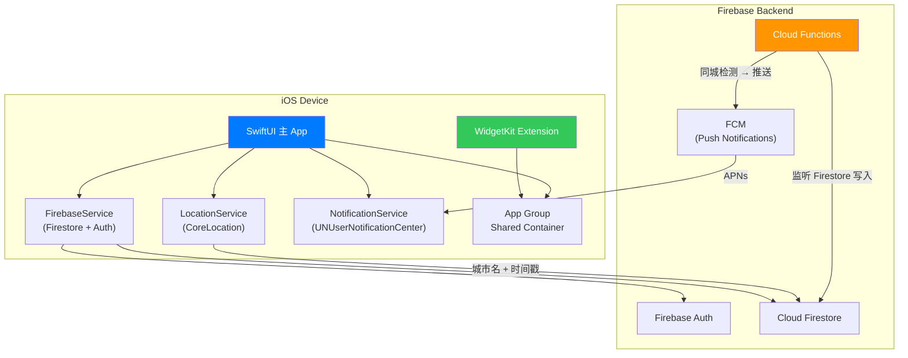
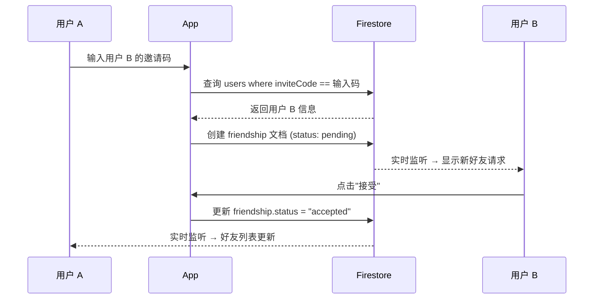

# 📍 Where's My Friend — Master Implementation Document

> **目标**：构建一款 iOS App，让用户能够实时查看朋友们所在的城市，通过 Widget 小组件在主屏幕上一目了然地展示好友位置，并在两位好友到达同一城市时自动推送通知。

> **GitHub**: https://github.com/yangwy30/where-is-my-friend

---

## 〇、已确认的设计决策

| 决策项 | 结论 | 备注 |
|--------|------|------|
| **设计理念** | 按可 scale 的方向开发 | 架构、数据模型、安全规则均按生产级标准设计 |
| **跨平台** | 暂不需要 Android | 选择 Firebase 后端，未来扩展到 Android 无阻力 |
| **好友上限** | **50 人** | Firestore `whereField("in")` 单次最多查 30 个，50 人只需 2 批查询；后续可提升 |
| **头像方案** | 三种方式，优先级：**照片 > Emoji > 文字头像（Initials）** | 照片用 Firebase Storage；Emoji 从预设列表选择；文字头像取名字首字母/首字 + 随机背景色作兜底 |
| **App 名称** | **Where's My Friend** | App Store 无同名位置分享类 App，名称可用 ✅ |

---

## 一、功能清单（Feature Specification）

### 核心功能

| # | 功能 | 描述 | 优先级 |
|---|------|------|--------|
| F1 | 用户注册/登录 | 使用 Firebase Authentication (Sign in with Apple + Email) 进行身份验证 | P0 |
| F2 | 好友系统 | 通过邀请码/链接添加好友，双方确认后才能互相查看位置 | P0 |
| F3 | 后台位置追踪 | 使用 Significant Location Change 在后台低功耗获取城市级位置 | P0 |
| F4 | 位置同步 | 将城市级位置信息上传至 Firebase Firestore，实时同步给好友 | P0 |
| F5 | 好友位置列表 | 在主 App 中展示所有好友的当前城市、最后更新时间 | P0 |
| F6 | iOS Widget 小组件 | 在主屏幕 Widget 上展示好友城市列表 | P0 |
| F7 | 同城通知 | 当两位好友到达同一城市时，服务端通过 FCM 推送通知 | P0 |

### 辅助功能

| # | 功能 | 描述 | 优先级 |
|---|------|------|--------|
| F8 | 隐身模式 | 用户可随时开关，关闭后好友看不到自己的位置 | P1 |
| F9 | 位置模糊化 | 只展示城市名 + 国旗 emoji，永远不暴露精确坐标 | P0 |
| F10 | 好友分组/备注 | 给好友添加昵称或分组 | P2 |
| F11 | 历史轨迹 | 查看好友过去 N 天分别在哪些城市（可选） | P2 |
| F12 | 引导/Onboarding | 首次启动时的权限说明、功能介绍 | P1 |
| F13 | 设置页 | 通知开关、隐身开关、账号管理、隐私政策 | P1 |

---

## 二、技术架构总览



### 技术栈选型

| 层级 | 技术选择 | 选择理由 |
|------|----------|----------|
| **UI 框架** | SwiftUI | 声明式 UI，与 WidgetKit 共享视图代码 |
| **架构模式** | MVVM + Service Layer | 清晰分层，便于测试和维护 |
| **最低部署版本** | iOS 17.0 | 支持 `@Observable` 宏、最新 WidgetKit API |
| **位置服务** | CoreLocation (Significant Location Change) | 城市级精度足够，极低耗电，App 被终止后系统也会唤醒 |
| **后端 / 数据库** | Firebase (Auth + Firestore + Cloud Functions + FCM) | 实时同步成熟、跨平台可扩展、免费额度充足 |
| **Widget** | WidgetKit (Static + App Intent Configuration) | Apple 原生，支持多尺寸 |
| **推送通知** | Firebase Cloud Messaging (FCM) + APNs | 服务端触发，免费且稳定 |
| **数据共享 (App ↔ Widget)** | App Group + Shared UserDefaults / JSON 文件 | Widget 无法直接访问 Firebase，需通过共享容器读取 |
| **反向地理编码** | CLGeocoder (设备端) + 服务端缓存 | 将经纬度转为城市名 |

---

## 三、所需资源与准备

### 3.1 Apple 开发者账号

| 项目 | 详情 |
|------|------|
| Apple Developer Program | 需要付费账号（$99/年）才能使用 Push Notifications、App Groups、发布到 App Store |
| Certificates & Profiles | 需要配置 APNs Key (.p8 文件)、App ID、Provisioning Profile |
| Capabilities 启用 | Push Notifications、Background Modes (Location updates, Remote notifications)、App Groups、Sign in with Apple |

### 3.2 Firebase 项目

| 项目 | 详情 |
|------|------|
| Firebase 项目 | 在 [Firebase Console](https://console.firebase.google.com/) 创建项目 |
| iOS App 注册 | 将 Bundle ID 注册到 Firebase，下载 `GoogleService-Info.plist` |
| 启用服务 | Firebase Authentication (Apple + Email)、Cloud Firestore、Cloud Functions、Cloud Messaging |
| APNs 密钥上传 | 在 Firebase Console → Project Settings → Cloud Messaging 中上传 .p8 密钥 |
| Blaze Plan | Cloud Functions 需要 Blaze (按量付费) 计划，但有免费额度，小规模使用基本免费 |

### 3.3 开发环境

| 工具 | 版本要求 |
|------|----------|
| macOS | Sequoia 15.0+ |
| Xcode | 16.0+ |
| Swift | 5.9+ (SwiftUI + @Observable) |
| Node.js | 18+ (用于编写 Cloud Functions) |
| Firebase CLI | 最新版 (`npm install -g firebase-tools`) |
| CocoaPods / SPM | Swift Package Manager（推荐） |

### 3.4 Firebase SDK 依赖 (Swift Package Manager)

```
https://github.com/firebase/firebase-ios-sdk.git
```

需要添加的产品：
- `FirebaseAuth`
- `FirebaseFirestore`
- `FirebaseMessaging`

---

## 四、数据模型设计

### 4.1 Firestore 数据结构

```
firestore-root/
├── users/                          ← Collection
│   └── {userId}/                   ← Document (userId = Firebase Auth UID)
│       ├── displayName: String     ← 显示名称
│       ├── email: String           ← 邮箱
│       ├── avatarEmoji: String     ← 头像 emoji（简化版，避免图片上传）
│       ├── currentCity: String     ← 当前城市名（如 "上海"）
│       ├── currentCountry: String  ← 当前国家名（如 "中国"）
│       ├── countryCode: String     ← 国家代码（如 "CN"，用于显示国旗）
│       ├── latitude: Double?       ← 纬度（仅后端使用，不暴露给好友）
│       ├── longitude: Double?      ← 经度（仅后端使用，不暴露给好友）
│       ├── locationUpdatedAt: Timestamp ← 位置最后更新时间
│       ├── isGhost: Bool           ← 是否处于隐身模式
│       ├── fcmToken: String        ← FCM 推送 Token
│       ├── inviteCode: String      ← 6位邀请码（唯一）
│       ├── photoURL: String?       ← 头像照片 URL（Firebase Storage），优先级最高
│       ├── avatarEmoji: String?    ← 头像 emoji（如 "🧑"），优先级第二
│       ├── avatarColor: String     ← 文字头像背景色 hex（如 "#FF6B6B"），兜底方案
│       ├── friendCount: Int        ← 当前好友数量（用于限制上限，MAX = 50）
│       └── createdAt: Timestamp
│
├── friendships/                    ← Collection
│   └── {friendshipId}/            ← Document (由两个 userId 排序拼接)
│       ├── users: [String]         ← 包含两个 userId 的数组
│       ├── status: String          ← "pending" | "accepted" | "blocked"
│       ├── requestedBy: String     ← 发起请求的 userId
│       └── createdAt: Timestamp
│
├── notifications_log/             ← Collection（防止重复通知）
│   └── {notificationId}/
│       ├── users: [String]         ← 触发通知的两个用户
│       ├── city: String            ← 同城城市名
│       ├── sentAt: Timestamp
│       └── type: String            ← "same_city"
```

### 4.2 Swift 数据模型

```swift
// MARK: - Constants
enum AppConstants {
    static let maxFriends = 50
    static let appGroupId = "group.com.yourname.whereismyfriend"
}

// MARK: - User Model
struct AppUser: Codable, Identifiable {
    var id: String                  // Firebase Auth UID
    var displayName: String
    var email: String
    var photoURL: String?           // Firebase Storage 头像照片 URL（优先级 1）
    var avatarEmoji: String?        // 头像 emoji, e.g. "🧑"（优先级 2）
    var avatarColor: String         // 文字头像背景色 hex, e.g. "#FF6B6B"（优先级 3，兜底）
    var currentCity: String?
    var currentCountry: String?
    var countryCode: String?        // ISO 3166-1 alpha-2, e.g. "CN", "US"
    var locationUpdatedAt: Date?
    var isGhost: Bool               // 隐身模式
    var fcmToken: String?
    var inviteCode: String
    var friendCount: Int            // 当前好友数，上限 AppConstants.maxFriends
    var createdAt: Date

    /// 头像展示优先级：照片 > Emoji > 文字 Initials
    enum AvatarType {
        case photo(URL)
        case emoji(String)
        case initials(String, Color)  // (首字母/首字, 背景色)
    }

    var avatarType: AvatarType {
        if let photoURL, let url = URL(string: photoURL) {
            return .photo(url)
        } else if let avatarEmoji, !avatarEmoji.isEmpty {
            return .emoji(avatarEmoji)
        } else {
            let initial = String(displayName.prefix(1))
            return .initials(initial, Color(hex: avatarColor))
        }
    }
}
struct Friendship: Codable, Identifiable {
    var id: String                  // friendshipId
    var users: [String]             // 两个 userId
    var status: FriendshipStatus
    var requestedBy: String
    var createdAt: Date
}

enum FriendshipStatus: String, Codable {
    case pending
    case accepted
    case blocked
}

// MARK: - Friend Location (用于 UI 展示)
struct FriendLocation: Identifiable {
    var id: String                  // userId
    var displayName: String
    var avatarEmoji: String
    var city: String
    var country: String
    var countryFlag: String         // 由 countryCode 转换的国旗 emoji
    var lastUpdated: Date
    var isGhost: Bool
}
```

### 4.3 App Group 共享数据 (App ↔ Widget)

Widget 无法直接访问 Firebase。主 App 在获取好友位置数据后，将简化版本写入 App Group 共享容器：

```swift
// 写入共享容器的简化模型
struct WidgetFriendData: Codable {
    var friends: [WidgetFriend]
    var lastSyncedAt: Date
}

struct WidgetFriend: Codable, Identifiable {
    var id: String
    var name: String
    var emoji: String
    var city: String
    var countryFlag: String
    var lastUpdated: Date
    var isGhost: Bool
}
```

存储方式：将 `WidgetFriendData` 编码为 JSON，写入 App Group 的 `UserDefaults` 或共享文件：

```swift
let appGroupId = "group.com.yourname.whereismyfriend"
let sharedDefaults = UserDefaults(suiteName: appGroupId)
let data = try JSONEncoder().encode(widgetFriendData)
sharedDefaults?.set(data, forKey: "widgetFriendData")

// 通知 Widget 刷新
WidgetCenter.shared.reloadAllTimelines()
```

---

## 五、Xcode 项目结构

```
WhereIsMyFriend/
├── WhereIsMyFriend.xcodeproj
├── WhereIsMyFriend/                        ← 主 App Target
│   ├── App/
│   │   ├── WhereIsMyFriendApp.swift        ← @main 入口，Firebase 初始化
│   │   └── AppDelegate.swift               ← 处理 push notification、SLC 唤醒
│   ├── Core/
│   │   ├── Services/
│   │   │   ├── LocationService.swift       ← CLLocationManager 封装
│   │   │   ├── GeocodingService.swift      ← 反向地理编码
│   │   │   ├── AuthService.swift           ← Firebase Auth 封装
│   │   │   ├── FirestoreService.swift      ← Firestore CRUD 封装
│   │   │   ├── NotificationService.swift   ← UNUserNotificationCenter + FCM
│   │   │   └── WidgetDataService.swift     ← 写入 App Group 共享数据
│   │   ├── Models/
│   │   │   ├── AppUser.swift
│   │   │   ├── Friendship.swift
│   │   │   └── FriendLocation.swift
│   │   └── Extensions/
│   │       ├── String+CountryFlag.swift    ← countryCode → 国旗 emoji
│   │       └── Date+Relative.swift         ← "5 分钟前" 格式化
│   ├── Features/
│   │   ├── Auth/
│   │   │   ├── LoginView.swift
│   │   │   ├── SignUpView.swift
│   │   │   └── AuthViewModel.swift
│   │   ├── Onboarding/
│   │   │   ├── OnboardingView.swift        ← 权限说明、功能介绍
│   │   │   └── PermissionRequestView.swift
│   │   ├── Friends/
│   │   │   ├── FriendsListView.swift       ← 好友位置主列表
│   │   │   ├── FriendsListViewModel.swift
│   │   │   ├── AddFriendView.swift         ← 输入邀请码
│   │   │   ├── FriendRequestsView.swift    ← 待处理的好友请求
│   │   │   └── FriendRowView.swift         ← 单行好友展示组件
│   │   ├── Profile/
│   │   │   ├── ProfileView.swift           ← 我的信息、邀请码展示
│   │   │   └── ProfileViewModel.swift
│   │   └── Settings/
│   │       ├── SettingsView.swift          ← 隐身模式、通知开关等
│   │       └── SettingsViewModel.swift
│   ├── Resources/
│   │   ├── Assets.xcassets
│   │   ├── GoogleService-Info.plist
│   │   └── Info.plist                      ← 位置权限描述字符串
│   └── Shared/                             ← 主 App 和 Widget 共享的代码
│       ├── WidgetFriendData.swift           ← 共享数据模型
│       └── AppGroupConstants.swift         ← App Group ID 常量
│
├── WhereIsMyFriendWidget/                  ← Widget Extension Target
│   ├── WhereIsMyFriendWidget.swift         ← Widget 入口 + Configuration
│   ├── WhereIsMyFriendWidgetBundle.swift
│   ├── TimelineProvider.swift              ← 从 App Group 读取数据
│   ├── FriendWidgetEntryView.swift         ← Widget UI
│   └── Assets.xcassets
│
└── CloudFunctions/                         ← Firebase Cloud Functions (Node.js)
    ├── package.json
    ├── index.js                            ← 同城检测 + 推送逻辑
    └── .eslintrc.js
```

> [!IMPORTANT]
> `Shared/` 目录下的文件必须同时添加到主 App 和 Widget Extension 两个 Target 的 Target Membership 中。

---

## 六、实现步骤（Step-by-Step）

### Phase 0：项目初始化与基础设施搭建

#### Step 0.1 — 创建 Xcode 项目
- 打开 Xcode → New Project → App
- Product Name: `WhereIsMyFriend`
- Interface: SwiftUI
- Language: Swift
- Minimum Deployments: iOS 17.0
- 勾选 "Include Tests"

#### Step 0.2 — 配置 Capabilities
在 Xcode 的 Signing & Capabilities 中为主 App Target 添加：
1. **Background Modes** → 勾选 `Location updates` 和 `Remote notifications`
2. **Push Notifications**
3. **App Groups** → 创建 `group.com.yourname.whereismyfriend`
4. **Sign in with Apple**

#### Step 0.3 — 创建 Firebase 项目
1. 访问 [Firebase Console](https://console.firebase.google.com/)，创建新项目
2. 添加 iOS App，填入 Bundle ID
3. 下载 `GoogleService-Info.plist`，拖入 Xcode 项目根目录
4. 在 Firebase Console 中启用：
   - Authentication → Sign-in method → Apple, Email/Password
   - Firestore Database → 创建数据库（先用 test mode）
   - Cloud Messaging
5. 升级到 Blaze 计划（用于 Cloud Functions，有免费额度）

#### Step 0.4 — 添加 Firebase SDK (SPM)
在 Xcode 中：File → Add Package Dependencies
- URL: `https://github.com/firebase/firebase-ios-sdk.git`
- 添加产品：`FirebaseAuth`, `FirebaseFirestore`, `FirebaseMessaging`

#### Step 0.5 — 初始化 Firebase
```swift
// WhereIsMyFriendApp.swift
import SwiftUI
import FirebaseCore

@main
struct WhereIsMyFriendApp: App {
    @UIApplicationDelegateAdaptor(AppDelegate.self) var delegate

    var body: some Scene {
        WindowGroup {
            ContentView()
        }
    }
}

// AppDelegate.swift
import UIKit
import FirebaseCore
import FirebaseMessaging

class AppDelegate: NSObject, UIApplicationDelegate {
    func application(_ application: UIApplication,
                     didFinishLaunchingWithOptions launchOptions: [UIApplication.LaunchOptionsKey: Any]?) -> Bool {
        FirebaseApp.configure()

        // 检查是否因 Significant Location Change 被唤醒
        if launchOptions?[.location] != nil {
            // 重新初始化 LocationService 以接收位置更新
            LocationService.shared.startMonitoring()
        }

        return true
    }
}
```

---

### Phase 1：用户认证系统

#### Step 1.1 — AuthService

封装 Firebase Auth 的登录、注册、登出、状态监听：

```swift
// Core/Services/AuthService.swift
@Observable
class AuthService {
    var currentUser: FirebaseAuth.User?
    var isAuthenticated: Bool { currentUser != nil }
    private var authStateHandle: AuthStateDidChangeListenerHandle?

    init() {
        authStateHandle = Auth.auth().addStateDidChangeListener { [weak self] _, user in
            self?.currentUser = user
        }
    }

    func signInWithApple(credential: ASAuthorizationAppleIDCredential) async throws { ... }
    func signInWithEmail(email: String, password: String) async throws { ... }
    func signUp(email: String, password: String, displayName: String) async throws { ... }
    func signOut() throws { ... }
}
```

#### Step 1.2 — 登录/注册 UI

- `LoginView.swift`: Sign in with Apple 按钮 + Email/Password 表单
- `SignUpView.swift`: 注册表单（邮箱、密码、显示名称、选择头像 emoji）
- `AuthViewModel.swift`: 管理认证状态，连接 AuthService

#### Step 1.3 — 用户 Profile 创建

注册成功后，在 Firestore 的 `users` 集合中创建用户文档：
- 自动生成 6 位唯一邀请码
- 设置默认头像 emoji
- `isGhost = false`

---

### Phase 2：好友系统

#### Step 2.1 — 邀请码生成

每个用户注册时生成唯一的 6 位字母数字邀请码：

```swift
func generateInviteCode() -> String {
    let chars = "ABCDEFGHJKLMNPQRSTUVWXYZ23456789" // 去掉容易混淆的 I,O,0,1
    return String((0..<6).map { _ in chars.randomElement()! })
}
```

#### Step 2.2 — 添加好友流程



#### Step 2.3 — Friendship ID 生成规则

为了避免重复创建，friendshipId 由两个 userId 按字母序排序后拼接：

```swift
func friendshipId(user1: String, user2: String) -> String {
    return [user1, user2].sorted().joined(separator: "_")
}
```

#### Step 2.4 — 好友列表查询

使用 Firestore 的 `array-contains` 查询当前用户的所有好友关系：

```swift
db.collection("friendships")
    .whereField("users", arrayContains: currentUserId)
    .whereField("status", isEqualTo: "accepted")
```

#### Step 2.5 — 好友请求 UI

- `AddFriendView`: 输入框 + "添加" 按钮，输入邀请码
- `FriendRequestsView`: 展示待处理的好友请求，支持"接受"/"拒绝"
- 在 `ProfileView` 中展示自己的邀请码，支持一键复制和分享

---

### Phase 3：位置追踪与同步

#### Step 3.1 — LocationService

```swift
// Core/Services/LocationService.swift
@Observable
class LocationService: NSObject, CLLocationManagerDelegate {
    static let shared = LocationService()

    private let locationManager = CLLocationManager()
    var authorizationStatus: CLAuthorizationStatus = .notDetermined
    var lastLocation: CLLocation?

    override init() {
        super.init()
        locationManager.delegate = self
        locationManager.allowsBackgroundLocationUpdates = true
        locationManager.pausesLocationUpdatesAutomatically = false
    }

    func requestAlwaysAuthorization() {
        locationManager.requestAlwaysAuthorization()
    }

    func startMonitoring() {
        guard CLLocationManager.significantLocationChangeMonitoringAvailable() else { return }
        locationManager.startMonitoringSignificantLocationChanges()
    }

    func stopMonitoring() {
        locationManager.stopMonitoringSignificantLocationChanges()
    }

    // MARK: - CLLocationManagerDelegate
    func locationManager(_ manager: CLLocationManager, didUpdateLocations locations: [CLLocation]) {
        guard let location = locations.last else { return }
        lastLocation = location
        // 触发反向地理编码 + 上传
        Task {
            await GeocodingService.shared.reverseGeocodeAndUpload(location: location)
        }
    }

    func locationManagerDidChangeAuthorization(_ manager: CLLocationManager) {
        authorizationStatus = manager.authorizationStatus
        if authorizationStatus == .authorizedAlways {
            startMonitoring()
        }
    }
}
```

> [!WARNING]
> **关键点**：当 App 因 Significant Location Change 被系统唤醒时（包括 App 已被终止的情况），`AppDelegate.didFinishLaunchingWithOptions` 的 `launchOptions` 中会包含 `.location` key。必须在此时重新初始化 `CLLocationManager` 并设置 delegate，否则会丢失位置更新。

#### Step 3.2 — GeocodingService（反向地理编码）

```swift
// Core/Services/GeocodingService.swift
class GeocodingService {
    static let shared = GeocodingService()
    private let geocoder = CLGeocoder()

    func reverseGeocodeAndUpload(location: CLLocation) async {
        do {
            let placemarks = try await geocoder.reverseGeocodeLocation(location)
            guard let placemark = placemarks.first else { return }

            let city = placemark.locality ?? placemark.administrativeArea ?? "Unknown"
            let country = placemark.country ?? "Unknown"
            let countryCode = placemark.isoCountryCode ?? "UN"

            // 上传到 Firestore
            await FirestoreService.shared.updateUserLocation(
                city: city,
                country: country,
                countryCode: countryCode,
                latitude: location.coordinate.latitude,
                longitude: location.coordinate.longitude
            )
        } catch {
            print("Geocoding error: \(error)")
        }
    }
}
```

> [!TIP]
> `CLGeocoder` 有调用频率限制（Apple 建议每分钟不超过 1 次）。由于 Significant Location Change 触发频率本身就很低（通常需要移动 500m+ 且切换基站），所以不会触及此限制。

#### Step 3.3 — Firestore 位置更新

```swift
// Core/Services/FirestoreService.swift (位置更新部分)
func updateUserLocation(city: String, country: String, countryCode: String,
                        latitude: Double, longitude: Double) async {
    guard let userId = Auth.auth().currentUser?.uid else { return }

    let data: [String: Any] = [
        "currentCity": city,
        "currentCountry": country,
        "countryCode": countryCode,
        "latitude": latitude,
        "longitude": longitude,
        "locationUpdatedAt": FieldValue.serverTimestamp()
    ]

    try? await db.collection("users").document(userId).updateData(data)

    // 同时更新 Widget 共享数据
    await WidgetDataService.shared.syncFriendsToWidget()
}
```

#### Step 3.4 — 监听好友位置变化

使用 Firestore 的实时监听（snapshot listener）获取好友位置变化：

```swift
// FriendsListViewModel.swift
func listenToFriendsLocations(friendIds: [String]) {
    // Firestore 的 whereField("in") 每次最多查询 30 个
    // 如果好友超过 30 个，需要分批查询
    for batch in friendIds.chunked(into: 30) {
        db.collection("users")
            .whereField(FieldPath.documentID(), in: batch)
            .addSnapshotListener { [weak self] snapshot, error in
                // 解析并更新 UI
                // 同时调用 WidgetDataService 更新 Widget 数据
            }
    }
}
```

#### Step 3.5 — Info.plist 权限描述

必须在 Info.plist 中添加以下 key：

```xml
<key>NSLocationAlwaysAndWhenInUseUsageDescription</key>
<string>我们需要持续获取您的位置信息，以便在后台更新您所在的城市，让好友们知道您当前在哪个城市。您可以随时在设置中关闭此权限。</string>

<key>NSLocationWhenInUseUsageDescription</key>
<string>我们需要您的位置信息来确定您当前所在的城市，并展示给您的好友。</string>

<key>UIBackgroundModes</key>
<array>
    <string>location</string>
    <string>remote-notification</string>
</array>
```

---

### Phase 4：Widget 小组件

#### Step 4.1 — 添加 Widget Extension Target

1. Xcode → File → New → Target → Widget Extension
2. Product Name: `WhereIsMyFriendWidget`
3. 取消勾选 "Include Live Activity" 和 "Include Configuration App Intent"
4. 在 Widget Target 的 Signing & Capabilities 中添加同一个 **App Groups**

#### Step 4.2 — TimelineProvider

```swift
// WhereIsMyFriendWidget/TimelineProvider.swift
struct Provider: TimelineProvider {
    func placeholder(in context: Context) -> FriendEntry {
        FriendEntry(date: Date(), friends: FriendEntry.placeholder)
    }

    func getSnapshot(in context: Context, completion: @escaping (FriendEntry) -> Void) {
        let entry = loadFriendsFromAppGroup()
        completion(entry)
    }

    func getTimeline(in context: Context, completion: @escaping (Timeline<FriendEntry>) -> Void) {
        let entry = loadFriendsFromAppGroup()
        // 30 分钟后请求下一次刷新
        let nextUpdate = Calendar.current.date(byAdding: .minute, value: 30, to: Date())!
        let timeline = Timeline(entries: [entry], policy: .after(nextUpdate))
        completion(timeline)
    }

    private func loadFriendsFromAppGroup() -> FriendEntry {
        let appGroupId = "group.com.yourname.whereismyfriend"
        guard let defaults = UserDefaults(suiteName: appGroupId),
              let data = defaults.data(forKey: "widgetFriendData"),
              let friendData = try? JSONDecoder().decode(WidgetFriendData.self, from: data) else {
            return FriendEntry(date: Date(), friends: [])
        }
        return FriendEntry(date: Date(), friends: friendData.friends.filter { !$0.isGhost })
    }
}
```

#### Step 4.3 — Widget UI

```swift
// WhereIsMyFriendWidget/FriendWidgetEntryView.swift
struct FriendWidgetEntryView: View {
    var entry: Provider.Entry
    @Environment(\.widgetFamily) var family

    var body: some View {
        switch family {
        case .systemSmall:
            // 显示前 3 个好友
            SmallWidgetView(friends: Array(entry.friends.prefix(3)))
        case .systemMedium:
            // 显示前 5 个好友
            MediumWidgetView(friends: Array(entry.friends.prefix(5)))
        case .systemLarge:
            // 显示所有好友
            LargeWidgetView(friends: entry.friends)
        default:
            Text("不支持的尺寸")
        }
    }
}

// 示例：每行好友的显示样式
// 🧑 小明    上海 🇨🇳    5分钟前
// 👩 小红    东京 🇯🇵    2小时前
// 🦊 小刚    纽约 🇺🇸    1天前
```

#### Step 4.4 — 支持的 Widget 尺寸

| 尺寸 | 展示内容 | 好友数量上限 |
|------|----------|-------------|
| Small | 好友名 + 城市 | 3 |
| Medium | 好友名 + 城市 + 国旗 + 更新时间 | 5 |
| Large | 完整列表 | 10+ |

#### Step 4.5 — Widget 刷新策略

- **主 App 前台时**：每次好友位置数据变化，调用 `WidgetCenter.shared.reloadAllTimelines()`
- **后台位置更新时**：在 `GeocodingService` 上传成功后，同步触发 Widget 刷新
- **系统自动刷新**：Timeline policy 设为 `.after(30分钟)` 作为兜底

> [!NOTE]
> Widget 每天有 40-70 次刷新预算。由于好友的城市级位置变化频率本身就很低（大多数人一天待在同一个城市），这个预算完全够用。

---

### Phase 5：同城推送通知

#### Step 5.1 — 配置 APNs

1. 在 Apple Developer Portal → Keys 中创建 APNs Key，下载 `.p8` 文件
2. 在 Firebase Console → Project Settings → Cloud Messaging → iOS 中上传 `.p8` 文件
3. 填入 Key ID 和 Team ID

#### Step 5.2 — App 端注册推送

```swift
// AppDelegate.swift
func application(_ application: UIApplication,
                 didRegisterForRemoteNotificationsWithDeviceToken deviceToken: Data) {
    Messaging.messaging().apnsToken = deviceToken
}

// 获取 FCM Token 并存入 Firestore
Messaging.messaging().token { token, error in
    if let token = token {
        FirestoreService.shared.updateFCMToken(token)
    }
}
```

#### Step 5.3 — Cloud Function：同城检测

```javascript
// CloudFunctions/index.js
const functions = require("firebase-functions");
const admin = require("firebase-admin");
admin.initializeApp();

const db = admin.firestore();

/**
 * 当用户位置更新时，检测是否有好友在同一城市。
 * 触发条件：users/{userId} 文档的 currentCity 字段变更。
 */
exports.onLocationUpdate = functions.firestore
    .document("users/{userId}")
    .onUpdate(async (change, context) => {
        const userId = context.params.userId;
        const before = change.before.data();
        const after = change.after.data();

        // 只在城市发生变化时处理
        if (before.currentCity === after.currentCity) return null;
        // 隐身用户不触发
        if (after.isGhost) return null;

        const newCity = after.currentCity;
        if (!newCity) return null;

        // 1. 查找该用户的所有已接受好友关系
        const friendshipsSnap = await db
            .collection("friendships")
            .where("users", "array-contains", userId)
            .where("status", "==", "accepted")
            .get();

        if (friendshipsSnap.empty) return null;

        // 2. 提取所有好友 ID
        const friendIds = [];
        friendshipsSnap.forEach((doc) => {
            const users = doc.data().users;
            const friendId = users.find((id) => id !== userId);
            if (friendId) friendIds.push(friendId);
        });

        // 3. 查找同城好友
        const notifications = [];
        for (const batch of chunkArray(friendIds, 30)) {
            const usersSnap = await db
                .collection("users")
                .where(admin.firestore.FieldPath.documentId(), "in", batch)
                .where("currentCity", "==", newCity)
                .where("isGhost", "==", false)
                .get();

            usersSnap.forEach((doc) => {
                notifications.push({
                    friendId: doc.id,
                    friendName: doc.data().displayName,
                    friendToken: doc.data().fcmToken,
                });
            });
        }

        // 4. 发送通知（避免重复）
        for (const friend of notifications) {
            // 检查过去 24 小时内是否已发过同城通知
            const recentNotif = await db
                .collection("notifications_log")
                .where("users", "array-contains", userId)
                .where("city", "==", newCity)
                .where("sentAt", ">", admin.firestore.Timestamp.fromDate(
                    new Date(Date.now() - 24 * 60 * 60 * 1000)
                ))
                .limit(1)
                .get();

            if (!recentNotif.empty) continue;

            const userName = after.displayName;

            // 给好友发通知：你的朋友到了你所在的城市
            if (friend.friendToken) {
                await admin.messaging().send({
                    token: friend.friendToken,
                    notification: {
                        title: "🎉 好友同城！",
                        body: `${userName} 也到了${newCity}！你们可以约一下 ☕️`,
                    },
                    apns: {
                        payload: {
                            aps: { sound: "default" },
                        },
                    },
                });
            }

            // 给当前用户发通知：你到了好友所在的城市
            if (after.fcmToken) {
                await admin.messaging().send({
                    token: after.fcmToken,
                    notification: {
                        title: "🎉 好友同城！",
                        body: `${friend.friendName} 也在${newCity}！你们可以约一下 ☕️`,
                    },
                    apns: {
                        payload: {
                            aps: { sound: "default" },
                        },
                    },
                });
            }

            // 记录通知日志
            await db.collection("notifications_log").add({
                users: [userId, friend.friendId].sort(),
                city: newCity,
                sentAt: admin.firestore.FieldValue.serverTimestamp(),
                type: "same_city",
            });
        }

        return null;
    });

// 辅助函数：数组分批
function chunkArray(array, size) {
    const chunks = [];
    for (let i = 0; i < array.length; i += size) {
        chunks.push(array.slice(i, i + size));
    }
    return chunks;
}
```

#### Step 5.4 — 部署 Cloud Functions

```bash
cd CloudFunctions
npm install
firebase deploy --only functions
```

#### Step 5.5 — 通知防重复机制

- 同一对好友 + 同一城市，**24 小时内只发一次通知**
- 使用 `notifications_log` 集合记录已发送通知
- Cloud Function 在发送前查询是否有最近的重复记录

---

### Phase 6：Onboarding 引导流程

#### Step 6.1 — 引导页设计

```
┌────────────────────────────┐
│  Page 1: 欢迎               │
│  "随时知道你的朋友在哪个城市"  │
│  [精美插图]                  │
│                            │
│  Page 2: 位置权限说明        │
│  "我们只会获取你所在的城市"    │
│  "永远不会追踪精确位置"       │
│  [请求 Always 位置权限]      │
│                            │
│  Page 3: 通知权限            │
│  "当好友到达你的城市时通知你"  │
│  [请求通知权限]              │
│                            │
│  Page 4: 开始使用            │
│  "分享你的邀请码给朋友"       │
│  [显示邀请码] [复制/分享]     │
└────────────────────────────┘
```

#### Step 6.2 — 权限请求时机

> [!IMPORTANT]
> **不要在 App 启动时立即请求权限！** Apple 审核指南要求在用户理解为什么需要权限之后，再弹出系统权限弹窗。在引导页中先用自定义 UI 解释原因，用户点击"允许"按钮后再触发系统弹窗。

---

### Phase 7：设置与隐私功能

#### Step 7.1 — 隐身模式

- 开关 toggle 在设置页
- 开启后：
  - Firestore 中 `isGhost = true`
  - 好友列表中该用户显示为 "🌙 隐身中"，不展示城市
  - Widget 中不展示该用户
  - 不触发同城通知
- 关闭后：立即恢复展示

#### Step 7.2 — 设置页内容

- 隐身模式开关
- 推送通知开关
- 我的邀请码
- 好友管理（删除好友）
- 账号管理（登出、删除账号）
- 隐私政策链接
- App 版本信息

---

### Phase 8：测试与优化

#### Step 8.1 — 测试计划

| 测试项 | 方法 |
|--------|------|
| 位置追踪 | 真机测试，需要物理移动（开车/地铁），Simulator 不可靠 |
| Widget 刷新 | 开启 WidgetKit Developer Mode（Settings → Developer → Widget），取消刷新预算限制 |
| 推送通知 | 使用 Firebase Console 手动发测试通知，然后测试 Cloud Function 自动触发 |
| 好友系统 | 使用两个测试账号互相添加好友 |
| 后台唤醒 | Kill app → 移动位置 → 检查 Firestore 是否更新 |
| 隐身模式 | 开启隐身 → 确认好友端看不到位置 → 确认不触发同城通知 |

#### Step 8.2 — Firestore 安全规则

```javascript
rules_version = '2';
service cloud.firestore {
  match /databases/{database}/documents {

    // 用户只能读写自己的文档
    match /users/{userId} {
      allow read: if request.auth != null;
      allow write: if request.auth != null && request.auth.uid == userId;
    }

    // 好友关系：只有参与的两个用户可以读写
    match /friendships/{friendshipId} {
      allow read: if request.auth != null
                  && request.auth.uid in resource.data.users;
      allow create: if request.auth != null
                    && request.auth.uid in request.resource.data.users;
      allow update: if request.auth != null
                    && request.auth.uid in resource.data.users;
      allow delete: if request.auth != null
                    && request.auth.uid in resource.data.users;
    }

    // 通知日志：只有 Cloud Functions 可以写入
    match /notifications_log/{notifId} {
      allow read: if false;
      allow write: if false; // 只通过 admin SDK 写入
    }
  }
}
```

#### Step 8.3 — 性能优化

- **Firestore 索引**：为 `friendships` 集合创建复合索引 (`users` + `status`)
- **位置更新节流**：如果反向地理编码结果和上次相同城市，不写入 Firestore
- **Widget 数据精简**：只传递展示所需的最小数据集到 App Group

---

### Phase 9：App Store 提交准备

#### Step 9.1 — App Store 审核要点

| 要求 | 处理方式 |
|------|----------|
| 位置权限说明 | Info.plist 中提供清晰的中英文描述 |
| 隐私政策 | 准备一个网页链接，说明数据收集范围和用途 |
| 电池使用提示 | App 描述中加入："持续使用 GPS 可能会增加电池消耗" |
| 审核账号 | 提供两个测试账号（已互为好友），让审核员测试 |
| App Review Notes | 详细解释为什么需要 Always 位置权限 |
| 隐私营养标签 | 在 App Store Connect 中如实填写数据收集类型 |

#### Step 9.2 — 隐私营养标签

需要声明的数据收集：
- **位置** — 粗略位置，用于核心功能
- **联系信息** — 邮箱地址，用于账号功能
- **标识符** — 用户 ID，用于 App 功能

---

## 七、里程碑与时间估算

| 阶段 | 内容 | 预估时间 |
|------|------|----------|
| Phase 0 | 项目初始化 + Firebase 配置 | 1 天 |
| Phase 1 | 用户认证系统 | 2-3 天 |
| Phase 2 | 好友系统 | 3-4 天 |
| Phase 3 | 位置追踪与同步 | 3-4 天 |
| Phase 4 | Widget 小组件 | 2-3 天 |
| Phase 5 | 同城推送通知 | 2-3 天 |
| Phase 6 | Onboarding 引导 | 1-2 天 |
| Phase 7 | 设置与隐私 | 1-2 天 |
| Phase 8 | 测试与优化 | 3-5 天 |
| Phase 9 | App Store 提交 | 1-2 天 |
| **总计** | | **约 20-30 天** |

---

## 八、国旗 Emoji 转换参考

通过 ISO 3166-1 alpha-2 国家代码转换为国旗 emoji：

```swift
extension String {
    /// 将 ISO 3166-1 alpha-2 国家代码（如 "CN"）转换为国旗 emoji（如 "🇨🇳"）
    var countryFlag: String {
        let base: UInt32 = 127397 // 🇦 的 Unicode 码点 - A 的 ASCII 码
        return self.uppercased().unicodeScalars.compactMap {
            UnicodeScalar(base + $0.value)
        }.map { String($0) }.joined()
    }
}

// 使用示例
"CN".countryFlag // "🇨🇳"
"US".countryFlag // "🇺🇸"
"JP".countryFlag // "🇯🇵"
```

---

## 九、Open Questions（已全部确认 ✅）

> [!NOTE]
> 所有初始 Open Questions 已在设计决策阶段确认，详见「〇、已确认的设计决策」章节。

| # | 问题 | 结论 |
|---|------|------|
| 1 | 目标用户规模 | 按可 scale 的方向设计，面向公开发布 |
| 2 | 跨平台需求 | 暂不需要 Android，使用 Firebase 保留扩展性 |
| 3 | 好友上限 | 50 人 |
| 4 | 头像方案 | 照片 > Emoji > 文字头像（Initials）三级方案 |
| 5 | App 名称 | Where's My Friend ✅ |

