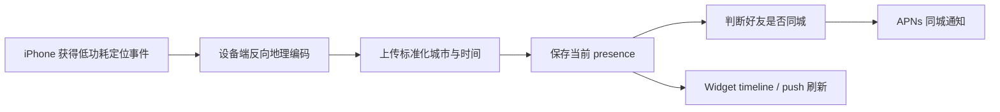

# Where Is My Friend?：从零到 App Store 发布计划

- 最后更新：2026-08-13
- 文档状态：v2，远程 Supabase Staging 路线已确定
- 目标平台：iPhone / iOS，包含 Widget

后端已经确定使用 Supabase Auth + PostgreSQL + Edge Functions，并以远程 Staging 为主开发环境；本机 Docker 不是前置条件。逐项账号配置、CLI 命令、Apple 登录、APNs、环境隔离和生产部署见 [Supabase 接入与生产发布实施计划](./docs/SUPABASE_PRODUCTION_PLAN.md)。

## 1. 产品定义

### 1.1 一句话愿景

让彼此信任的朋友不用主动询问，就能知道对方最近身处哪座城市，并在大家恰好来到同一座城市时收到温和的提醒。

### 1.2 产品边界

产品展示的是“最近所在城市”，不是实时坐标。任何界面都必须同时显示更新时间，并区分新鲜、较旧和不可用状态。

建议的数据新鲜度定义：

| 状态 | 建议阈值 | UI 表达 |
| --- | --- | --- |
| 新鲜 | 2 小时以内 | `New York · 18 分钟前` |
| 较旧 | 2–24 小时 | 降低视觉强调并显示具体时间 |
| 过期 | 超过 24 小时 | `位置暂时不可用`，不参与同城判断 |
| 暂停 | 用户主动暂停 | `已暂停共享` |

最终阈值应在 TestFlight 阶段根据真实后台更新数据调整。

### 1.3 MVP 用户故事

- 作为用户，我可以使用 Apple 账号登录并创建个人资料。
- 作为用户，我可以通过邀请链接或用户名邀请朋友。
- 作为用户，我必须明确接受邀请后才建立好友关系。
- 作为用户，我可以决定是否向朋友分享我的城市。
- 作为用户，我可以看到朋友的城市、更新时间和共享状态。
- 作为用户，我可以把朋友列表添加为 iOS Widget。
- 作为用户，我可以选择是否接收同城提醒。
- 作为用户，我可以暂停共享、移除或屏蔽朋友。
- 作为用户，我可以在 App 内发起账号及关联数据删除。

### 1.4 MVP 不做的内容

- 精确经纬度展示、实时移动路线或历史轨迹
- 后台持续 GPS 导航级定位
- 未经双方确认的关注或位置查看
- 公共用户搜索、附近陌生人或社交信息流
- 群组、聊天、照片、付费订阅
- Android、iPad 专属界面、Apple Watch 和 Web 客户端

## 2. 必须接受的平台现实

### 2.1 后台定位

iOS 决定后台定位事件何时到达，服务端不能主动拉取一台 iPhone 的实时位置。MVP 应优先使用 Visits 与 Significant Location Change；只在前台刷新或必要的校验场景使用一次性标准定位，避免持续 GPS。

后台自动处理部分定位事件需要用户授予 Always 权限。权限被拒绝、设备离线、手机关机或系统没有产生定位事件时，位置会变旧，这是正常状态，不是程序可以完全消除的故障。

官方参考：

- [选择合适的 Core Location 服务](https://developer.apple.com/documentation/CoreLocation/getting-the-current-location-of-a-device)
- [请求定位授权](https://developer.apple.com/documentation/corelocation/requesting-authorization-to-use-location-services)
- [处理后台定位更新](https://developer.apple.com/documentation/corelocation/handling-location-updates-in-the-background)

### 2.2 Widget 更新

Widget 扩展不会持续运行。WidgetKit 使用 timeline 和系统刷新预算；Widget push 也由系统预算并机会性投递。因此 Widget 必须读取最后已知数据、显示更新时间，并允许用户点入主 App 获取更完整状态。

官方参考：

- [保持 Widget 更新](https://developer.apple.com/documentation/widgetkit/keeping-a-widget-up-to-date/)
- [使用 WidgetKit push 更新 Widget](https://developer.apple.com/documentation/widgetkit/updating-widgets-with-widgetkit-push-notifications)

### 2.3 通知

同城判断应在服务端发生。当某个用户的城市发生有效变化时，服务端生成幂等事件并通过 APNs 发送可见通知；不要依赖 silent push 保证业务正确性。

官方参考：[设置 APNs 通知服务端](https://developer.apple.com/documentation/usernotifications/setting-up-a-remote-notification-server)

## 3. 隐私与安全原则

这些原则属于发布门槛，而不是后续优化：

1. 默认只共享城市，不向朋友展示精确坐标。
2. 好友关系和位置共享都需要清晰、可撤回的同意。
3. 每个位置记录都带更新时间；过期记录不触发同城通知。
4. 默认不保存历史位置，只保存当前城市与必要的审计信息。
5. 尽可能在设备端完成反向地理编码，再上传标准化城市字段。
6. 所有客户端到服务端通信使用 TLS；敏感数据静态加密。
7. 服务端对每次读取执行用户身份和好友关系授权，不能依赖客户端隐藏 UI。
8. 支持屏蔽、删除好友、暂停共享、退出登录和删除账号。
9. 日志、崩溃报告和分析事件不得包含坐标、城市明文或好友名单。
10. 在开始外部测试前完成威胁模型和数据流审查。

Apple 要求所有 iOS App 提供隐私政策 URL，并在 App Store Connect 准确申报自身及第三方 SDK 的数据处理行为。支持账号创建的 App 还必须允许用户在 App 内发起完整账号删除。

官方参考：

- [App Review Guidelines](https://developer.apple.com/app-store/review/guidelines/)
- [管理 App Privacy 信息](https://developer.apple.com/help/app-store-connect/manage-app-information/manage-app-privacy)
- [在 App 内提供账号删除](https://developer.apple.com/support/offering-account-deletion-in-your-app/)

## 4. 建议技术架构

### 4.1 iOS 客户端

- Swift 与 SwiftUI
- Core Location：Visits、Significant Location Change、前台一次性定位
- WidgetKit：Widget timeline、共享缓存、可用时接入 Widget push
- AuthenticationServices：Sign in with Apple
- UserNotifications：通知授权与 APNs token 管理
- App Groups：主 App 与 Widget 共享最小化缓存
- XCTest / XCUITest：单元、集成与关键 UI 流程测试

### 4.2 服务端

服务端已经选定 Supabase：Supabase Auth 负责生产身份与 session，PostgreSQL 负责事务和业务状态，Edge Functions 提供现有 REST API 并执行逐请求授权。iOS 不直接读取业务表，service role 只存在于后端。

该方案必须支持：

- 用户鉴权与 Sign in with Apple token 验证
- 关系型数据库和事务
- HTTPS API
- 后台任务或事件处理
- APNs provider 集成
- 数据备份、密钥管理、日志与告警
- staging 与 production 环境隔离

建议的数据实体：

| 实体 | 关键内容 |
| --- | --- |
| `users` | Apple subject、显示名、账号状态 |
| `friendships` | 请求方、接收方、pending/accepted/blocked 状态 |
| `sharing_preferences` | 用户对好友的共享和通知选择 |
| `presence` | 当前标准化城市、更新时间、有效期、来源版本 |
| `devices` | APNs token、环境、最后活跃时间 |
| `colocation_events` | 用户对、城市、事件周期、通知幂等键 |
| `deletion_requests` | 删除请求、状态和完成时间 |

### 4.3 城市标准化

不要直接比较 UI 中的城市名称。建议形成稳定键：

```text
country_code + administrative_area + locality
```

设备端反向地理编码后上传结构化字段。对于 locality 缺失、同名城市、直辖市和城市边界等例外，维护版本化的标准化规则与测试样例。服务端只保留当前城市；如为排错短暂接收坐标，必须在同一处理流程中转换并丢弃，且不得进入普通日志。

### 4.4 数据流



## 5. 分阶段执行计划

总工期估算：单人全职约 10–14 周。它是规划范围，不是发布日期承诺；Apple 审核、后台定位表现和隐私整改可能影响时间。

### 阶段 0：产品基线与风险确认（2–3 天）

任务：

- 固化产品承诺、MVP 范围和非目标
- 定义新鲜、较旧、过期和暂停状态
- 设计主要用户流程与低保真线框图
- 明确首发国家/地区、语言和最低 iOS 版本
- 确认个人或组织 Apple Developer 账号主体
- 建立风险清单、决策日志和验收标准

交付物：产品简报、用户流程、权限文案草案、发布范围决策。

退出条件：团队能用同一句话解释产品，而且没有“实时位置”的错误承诺。

### 阶段 1：工程与服务端基础（第 1 周）

任务：

- 新建 Xcode workspace、iOS App target、Widget Extension 和测试 targets
- 统一 bundle identifier、App Group、开发/生产配置
- 确定服务端方案并记录 ADR
- 建立 staging / production 环境与 secrets 管理
- 配置代码风格、静态检查、单元测试和 CI
- 建立数据库迁移与 API 版本策略
- 创建 Debug、Staging、Release 构建配置

交付物：能在模拟器和真机启动的空壳 App；CI 能构建并运行测试；staging 健康检查通过。

退出条件：任何新提交都能自动构建，密钥不进入 Git。

### 阶段 2：账号、好友与授权模型（第 2–3 周）

任务：

- 接入 Sign in with Apple
- 创建/恢复用户账号和个人资料
- 实现邀请链接或用户名邀请
- 实现接受、拒绝、移除和屏蔽好友
- 服务端实现逐请求授权与速率限制
- 增加按好友共享开关与全局暂停
- 实现账号删除入口和后端删除任务

测试重点：重复邀请、过期邀请、被屏蔽用户、撤回共享、退出后 token 失效、删除账号后数据不可访问。

退出条件：没有获得双方确认的用户无法读取任何 presence 数据。

### 阶段 3：城市 presence 管线（第 4–5 周）

任务：

- 设计定位权限教育页，先解释价值再请求系统权限
- 支持 When In Use，并在用户启用后台共享时升级请求 Always
- 接入 Visits 与 Significant Location Change
- 前台打开 App 时执行节制的一次性定位刷新
- 设备端反向地理编码与城市标准化
- 上传、去重、重试和离线队列
- 服务端保存当前 presence 并计算过期状态
- 在 UI 中展示权限关闭、离线、过期和暂停状态

测试重点：无网络、低电量模式、重启、权限降级、关闭精确位置、跨时区、城市边界、同名城市和重复定位事件。

退出条件：至少进行 72 小时多设备真机测试，能够解释每次城市更新或未更新的原因，且没有持续 GPS 或明显异常耗电。

### 阶段 4：主界面与 Widget（第 6 周）

任务：

- 完成朋友城市列表、空状态、错误状态和刷新状态
- 按新鲜度和用户选择排序
- 建立 App Group 最小化共享缓存
- 实现至少 Small 和 Medium Widget
- 实现 timeline、深链和隐私占位内容
- 评估并按最低系统版本接入 WidgetKit push
- 在 Widget 中始终显示或可理解地表达更新时间

测试重点：Widget 首次添加、登出、账号切换、数据过期、无网络、刷新预算、深链和锁屏内容泄露。

退出条件：Widget 即使拿不到新数据，也不会显示误导性的“实时”状态或其他账号的数据。

### 阶段 5：同城检测与通知（第 7 周）

任务：

- 注册和轮换 APNs device token
- 实现同城事件状态机与幂等键
- 仅用新鲜 presence 参与同城计算
- 增加离开判定、冷却时间和边界防抖
- 双方分别控制通知偏好
- 设计通知文案、点击深链与通知历史页
- 监控 APNs 无效 token 与发送失败

推荐规则：

- 只有城市键发生变化时运行主要匹配
- 任一方 presence 过期则不通知
- 相同用户对、相同城市、相同同城周期只生成一个事件
- 任何一方暂停共享或屏蔽后立即停止匹配

退出条件：重试、重复请求和多设备登录都不会产生重复通知。

### 阶段 6：隐私、安全与可访问性发布门槛（第 8 周）

任务：

- 完成数据流图和威胁模型
- 审计 API 越权、IDOR、token 生命周期和速率限制
- 审计数据库访问策略、备份、恢复和删除流程
- 验证日志与分析不含敏感位置数据
- 编写并部署隐私政策与支持页面
- 完成 App 内账号删除和 Sign in with Apple token 撤销
- 准备 App Privacy 数据类型清单
- 完成 VoiceOver、Dynamic Type、对比度和 Reduce Motion 检查
- 对锁屏、Widget 和通知内容提供隐私控制

退出条件：能回答“收集什么、为什么、保存多久、谁能看到、如何撤回和如何删除”，并由实际实现验证答案。

### 阶段 7：质量保证与 TestFlight（第 9–10 周）

任务：

- 单元测试：城市标准化、新鲜度、同城状态机、授权规则
- 集成测试：登录、邀请、presence 上传、APNs、账号删除
- UI 测试：首次启动、权限、好友流程、暂停与删除
- 真机矩阵：至少两代 iPhone 和最低/最新支持 iOS
- 网络矩阵：离线、弱网、切换网络和后台恢复
- 运行性能、内存、能耗、崩溃和启动时间检查
- 内部 TestFlight 后再邀请小规模外部测试者
- 收集定性反馈和非敏感运行指标
- 建立阻断级、严重级和一般级缺陷标准

建议发布阻断项：

- 任何位置越权或跨账号数据泄露
- 删除账号不完整
- 同城通知大量重复或错误
- 后台定位导致明显异常耗电
- Widget 展示错误账号或过期信息却没有提示
- 崩溃、登录死循环或无法撤回共享

退出条件：连续 7 天没有发布阻断缺陷，关键流程成功率达到团队设定目标，并完成一次生产恢复演练。

### 阶段 8：App Store 准备与提交（第 11 周）

前置事项：

- Apple Developer Program 会员有效
- App ID、证书、profiles、App Group 和 APNs entitlement 正确
- App Store Connect 已创建 App 记录
- 版本号、build 号、bundle ID 与上传记录一致

商店素材：

- App 名称、副标题、描述、关键词和分类
- App icon 与要求尺寸的截图
- 支持 URL、隐私政策 URL、营销 URL（可选）
- 年龄分级、版权、联系人信息
- App Review notes、演示账号或审核操作说明
- 清楚解释后台定位用途、权限触发路径与同城通知行为
- App Privacy 问卷与第三方 SDK 数据申报

提交流程：

1. 用 Xcode Archive 创建 Release 构建并完成本地验证。
2. 上传 App Store Connect，等待构建处理完成。
3. 将候选构建发给内部和外部 TestFlight 做最后回归。
4. 在 App Store Connect 选择正确构建并补齐元数据。
5. 添加到审核并提交 App Review。
6. 若被拒，记录原因、修复、回归，并在 Resolution Center 清晰回复。
7. 审核通过后优先选择手动发布或分阶段发布，确保团队在线观察。

官方参考：

- [App Store Connect 工作流](https://developer.apple.com/help/app-store-connect/get-started/app-store-connect-workflow)
- [上传构建](https://developer.apple.com/help/app-store-connect/manage-builds/upload-builds/)
- [提交 App Review](https://developer.apple.com/help/app-store-connect/manage-submissions-to-app-review/submit-an-app)

退出条件：版本状态为可发布或已发布，生产监控、支持渠道和回滚方案都已就绪。

### 阶段 9：发布与发布后 30 天（第 12–14 周）

发布当天：

- 验证生产登录、好友邀请、presence、通知和 Widget
- 观察崩溃、API 错误率、APNs 失败率和延迟
- 准备快速关闭同城通知或后台任务的 feature flag
- 回复早期支持请求，不要求用户通过不安全方式提供位置数据

第 1 周：

- 每日检查稳定性与后台更新分布
- 修复阻断问题，谨慎发布补丁
- 对比测试假设与真实数据，调整过期阈值

第 2–4 周：

- 复盘权限接受率、好友建立率、Widget 使用率和同城提醒质量
- 审查账号删除完成时间和支持请求
- 决定 v1.1，仅选择能强化核心体验的内容
- 完成安全、隐私和运营复盘

## 6. 质量指标

指标不得记录精确位置或可重建好友关系的原始内容。

| 类别 | 指标 |
| --- | --- |
| 稳定性 | Crash-free sessions、启动成功率、Widget 加载失败率 |
| 定位健康 | presence 新鲜度分布、上传失败率、权限状态分布 |
| 通知质量 | 发送成功率、重复抑制率、用户关闭率 |
| 核心漏斗 | 登录完成、好友邀请接受、首次 Widget 添加 |
| 隐私运营 | 删除请求完成时间、越权测试通过率、敏感日志事件数 |

正式目标值应在内部 TestFlight 得到基线后确定，避免凭空设置无法解释的数字。

## 7. 测试矩阵

至少覆盖：

- 新用户、老用户、无好友、多个好友
- When In Use、Always、拒绝、撤销、Precise Location 关闭
- App 前台、后台、系统终止、设备重启
- 在线、离线、弱网、飞行模式、低电量模式
- 同城、跨城、城市边界、跨国、时区变化
- 单设备与同一账号多设备
- APNs token 轮换、通知关闭、Widget 删除和重加
- 好友删除、屏蔽、暂停共享和账号删除
- 服务端重试、乱序事件、重复事件和延迟事件

说明：用户手动强制退出 App 等系统行为需要在目标 iOS 版本真机上记录实际结果，UI 必须能诚实表达数据可能过期。

## 8. 发布前最终清单

### 产品

- [ ] 所有界面使用“最近所在城市”语言
- [ ] 城市旁显示更新时间或清晰的过期状态
- [ ] 分享、暂停、屏蔽和删除流程清楚可见

### 工程

- [ ] Release 构建无调试服务器、测试账号或硬编码密钥
- [ ] CI、单元、集成与 UI 测试通过
- [ ] 数据库迁移、备份和恢复演练通过
- [ ] APNs production 环境验证通过

### 隐私与安全

- [ ] 最小化位置数据并验证保存期限
- [ ] App 内账号删除端到端通过
- [ ] 隐私政策、支持页面和 App Privacy 答案一致
- [ ] 权限文案具体解释后台城市共享价值
- [ ] 完成越权、屏蔽和撤回共享测试

### App Store

- [ ] App Store Connect 元数据完整
- [ ] 截图与实际版本一致
- [ ] 年龄分级和出口合规问题已回答
- [ ] 审核说明包含定位和 Widget 的测试步骤
- [ ] TestFlight 候选版本完成最终回归
- [ ] 发布、监控和紧急开关负责人明确

## 9. 关键风险与缓解

| 风险 | 影响 | 缓解方式 |
| --- | --- | --- |
| 用户期待秒级实时 | 信任下降 | 产品文案和 UI 始终展示“最近”与更新时间 |
| Always 权限接受率低 | 更新不及时 | 分阶段请求权限，先展示价值，支持有限模式 |
| Widget 刷新受系统预算限制 | 信息较旧 | timeline + 缓存 + push，清楚显示新鲜度 |
| 城市边界抖动 | 错误或重复通知 | 标准化、冷却期、状态机和幂等键 |
| 位置数据越权 | 严重安全事故 | 服务端逐请求授权、最小化数据、自动化安全测试 |
| App Review 质疑后台定位 | 发布延迟 | 明确核心用途、最小功耗实现和详细审核说明 |
| 小团队服务端运维不足 | 可用性下降 | 托管服务、环境隔离、告警、备份和恢复演练 |

## 10. 项目管理规则

- 每个阶段建立 GitHub milestone，每项工作用 issue 跟踪。
- 每个 issue 必须写明用户价值、范围、验收标准和隐私影响。
- 使用短生命周期分支和 Pull Request；主分支始终保持可构建。
- 任何涉及位置、好友授权、日志或第三方 SDK 的变更必须进行隐私审查。
- 功能完成的定义包括代码、测试、文档、监控和失败状态，不只包括正常路径 UI。
- 每周更新风险、实际进度和下一阶段 Go/No-Go 决策。

## 11. 第一个开发迭代的具体任务

在正式写业务代码前，按以下顺序开始：

1. 确定最低 iOS 版本、首发地区和 Apple Developer 账号主体。
2. 为产品承诺、数据保留、城市标准化和服务端方案各写一份 ADR。
3. 画出登录、好友邀请、权限教育、朋友列表、Widget 和暂停共享流程。
4. 创建 Xcode 工程、Widget target、测试 targets 和 App Group。
5. 建立 staging API、数据库迁移、secrets 与 CI。
6. 用两个测试账号完成“登录—邀请—接受—读取空 presence”的垂直切片。
7. 通过代码审查和自动化测试后，再开始后台定位实现。

完成这七项，项目才从“规划阶段”进入“开发阶段”。
