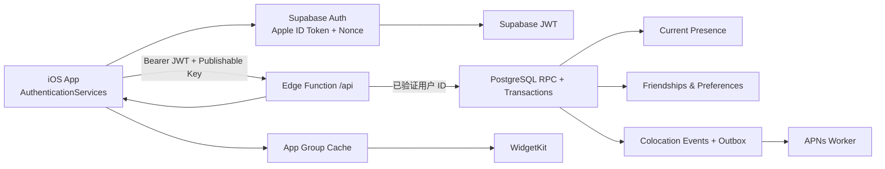

# Supabase 接入与生产发布实施计划

- 最后更新：2026-08-13
- 状态：执行版 v2（远程 Staging 优先）
- 目标：从当前已验证的数据库纵切，直接推进到可供 TestFlight 与 App Store 使用的 Supabase Staging / Production 后端
- 原则：远程 Staging 是主开发环境，PGlite 是本机迁移预检，Docker 仅为可选工具；所有 schema 变化只通过迁移；iOS 永远不持有服务端密钥

## 1. 最终技术路线

本项目采用下面这一条路线，不同时维护两套生产架构：



明确决策：

1. **Supabase Auth 管身份和 session**：生产登录使用原生 Sign in with Apple，再用 identity token 与原始 nonce 换取 Supabase session。
2. **Edge Function 管业务 API**：客户端继续调用现有 `/v1/...` REST 合同，不直接操作 friendships、presence 或 events 表。
3. **PostgreSQL 管事务和状态机**：好友接受、暂停分享、同城进入/离开和通知去重由数据库函数原子完成。
4. **App Group 只保存最小快照**：Widget 读取主 App 最近同步的数据，不直接连接数据库。
5. **APNs 由后端 outbox worker 发送**：同城事件写入与通知排队在同一事务内，重试不能产生重复事件。

### 为什么生产环境改用 Supabase Auth

初始仓库曾用 `app_sessions` 与 `/v1/auth/debug` 验证本地双用户流程；它们属于已经结束的过渡实现。当前 Staging 已改用 Supabase Auth，直接获得签名 JWT、refresh token 轮换、session 恢复和服务端用户验证。

迁移完成后：

- `app_sessions` 不再承担生产 session；确认无引用后用后续迁移删除。
- `/v1/auth/debug` 已从 Edge API 删除；本地 UI 演示由 `LocalDemoRepository` 独立提供。
- `/api` 在托管环境开启 JWT 验证，并从 JWT 推导用户，绝不接受客户端传入的 `user_id`。

## 2. 当前仓库基线

### 已完成

- [x] Supabase CLI 已作为项目 dev dependency 固定版本
- [x] `supabase/config.toml`、迁移与本地 seed 已建立
- [x] 好友、分享、presence、同城 session、event 与 outbox schema 已建立
- [x] Edge REST API 第一版已建立
- [x] iOS `RemoteAppRepository` 与 Keychain token 边界已建立
- [x] 本地 UI 演示与远程 Auth 完全分离
- [x] PostgreSQL 纵切测试覆盖邀请、接受、同城去重与暂停分享
- [x] Debug / Release 构建和 iOS 单元测试通过
- [x] Staging iOS build settings 已配置远程 Function URL、Supabase URL 与 publishable key
- [x] APNs token AES-GCM 加密、安装级多设备注册、逐设备 outbox delivery 与 `push-worker` 代码/测试已完成
- [x] Push migration 已部署到 Staging；业务 API v4 与 `push-worker` v1 均为 ACTIVE
- [x] Staging 已设置 device-token encryption、worker authentication、Team ID、bundle ID 与 URL scheme secrets

### 尚未完成

- [x] 确定不把本地 Docker 作为实施前置条件
- [x] 创建 Supabase Staging project；Production 在 Staging 验收后再创建
- [x] 将已验证的 migration 推送到远程 Staging
- [x] 接入 Supabase Swift Auth 2.54.1；Staging Apple provider 已启用
- [x] 将 `app_users` 一对一映射到 `auth.users`
- [x] 将 Edge API 从自定义 token 切换到 Supabase 用户 JWT
- [ ] 设置 APNs `.p8` / Key ID，启用 Staging Cron 并完成双真机 push；Production push 在 Staging 验收后配置
- [ ] 完成 Apple authorization code 交换、refresh token 保存与删除账号时撤销
- [ ] 建立 GitHub Actions 的 Staging / Production 部署门禁
- [ ] 完成真机后台定位、TestFlight 和 App Store 验收

## 3. 密钥与配置边界

| 配置 | 可以进入 iOS | 可以进入 Git | 保存位置 |
| --- | --- | --- | --- |
| Supabase project URL | 是 | 是，可用 build setting | Xcode Staging / Release 配置 |
| Supabase publishable key | 是 | 可以，但建议按环境配置 | Xcode build setting；它不是服务端密钥 |
| Supabase secret / service role key | **绝对不可以** | **绝对不可以** | Supabase Edge 自动环境或 Dashboard secret |
| Database password | 不可以 | 不可以 | 密码管理器、GitHub encrypted secret |
| Supabase personal access token | 不可以 | 不可以 | 本机 CLI、GitHub encrypted secret |
| Apple Sign in `.p8` | 不可以 | **绝对不可以** | 密码管理器/密钥库，部署为 Edge secret |
| APNs `.p8` | 不可以 | **绝对不可以** | 密码管理器/密钥库，部署为 Edge secret |

任何时候都不要把 service role、数据库密码或 `.p8` 内容粘进 Xcode、Issue、日志、截图或聊天。Edge Functions 的托管环境会自动提供 Supabase 服务端连接信息，iOS 不需要知道它们。

## 4. 阶段 A：创建并连接远程 Staging（0.5 天）

当前 Staging：

- Project：`where-is-my-friend-staging`
- Project ref：`cdhpaujazbuppbxyhjxq`
- Region：East US (Ohio)
- URL：`https://cdhpaujazbuppbxyhjxq.supabase.co`

### 你的操作

1. 登录 [Supabase Dashboard](https://supabase.com/dashboard)。
2. 创建组织（如尚未创建）。
3. 创建项目 `where-is-my-friend-staging`；暂时不要创建 Production。
4. Region 选择靠近首批真实测试用户的位置。项目创建后不应随意换区。
5. 用密码管理器生成并保存高强度 Database Password。
6. 为 Supabase 账号和关联 GitHub 账号开启 2FA。
7. 在 Project Settings 中记录以下非秘密信息：
   - Project ref
   - Project URL
   - Publishable key

不要提供或复制 service role/secret key。Database Password 仅在 CLI 要求时由你本人输入。

### 本机预检与 CLI 连接

当前路线不需要 Docker。仓库中的 PGlite 会在本机执行完整 migration 和业务状态机测试：

```bash
npm ci
npm run backend:test
```

测试通过后登录并连接远程 Staging：

```bash
npx supabase login
npx supabase projects list
npx supabase link --project-ref <STAGING_PROJECT_REF>
npx supabase migration list --linked
```

`supabase login` 会打开浏览器完成授权；不要把 Personal Access Token 写进仓库。`link` 可能要求输入 Staging Database Password。

### 退出条件

- [x] Staging project 已创建且 Region 确认无误
- [x] Project ref、URL、publishable key 已安全记录
- [x] `npm run backend:test` 全绿
- [x] `supabase projects list` 明确标识当前 linked project 是 Staging
- [x] Production project 尚未创建

## 5. 阶段 B：推送数据库基线（0.5 天）

远程 Staging 是空项目，没有真实用户，因此可以直接承载第一版 migration。但每次远程变更仍必须先经过本地 PGlite 和 dry-run。

### 推送步骤

```bash
npm run backend:test
npx supabase projects list
npx supabase db push --dry-run --linked
npx supabase db push --linked
npx supabase migration list --linked
```

重要规则：

- 托管项目只执行 migrations，不执行本地 `seed.sql`。
- Staging 中不创建 Alice / Bob Debug seed 用户。
- 不要对 Production 使用 `--include-seed`。
- 不要对 Production 使用 `supabase db reset --linked`。
- 每次 push 前先确认 `projects list` 显示的 linked project。
- 不在 Dashboard Table Editor 或 SQL Editor 临时修改 schema；确需紧急修改时也必须立即补等价 migration。

### 为什么数据库基线阶段没有部署旧 `/api`

当时 Edge API 仍使用本地纵切的自定义 `app_sessions`，所以没有把过渡认证部署到远程。阶段 C 已把 Function 改成 `verify_jwt=true`，删除远程 Debug 登录，并通过验证后的 Auth UUID 映射业务用户。

这能避免把“能运行但不是生产身份模型”的 Function 暴露在互联网上。

### 退出条件

- [x] 初始 migration 已在 Staging 成功应用，业务表、索引和函数由同一 migration 原子创建
- [x] 所有业务表启用 RLS；携带有效 publishable key 的匿名表读取返回 `42501 permission denied`
- [x] CLI 只应用 migration，没有执行 `seed.sql` 或创建 Alice / Bob
- [x] `migration list --linked` 显示本地与 Staging migration 一致
- [x] 数据库基线推送阶段没有部署旧 API；阶段 C 完成后才部署受 JWT 保护的 API

## 6. 阶段 C：迁移到 Supabase Auth + Sign in with Apple（2–4 天）

这是开始 TestFlight 前最重要的后端改造。

### C1. Apple Developer 配置——你的操作

1. 确认 Apple Developer Program 会员有效。
2. 为以下 App ID 启用 Sign in with Apple：
   - Production：`com.yangwy30.whereismyfriend`
   - Staging：`com.yangwy30.whereismyfriend.staging`
3. 确认 Xcode targets 的 Team、bundle ID 和 entitlements 一致。
4. 原生 iOS Staging 登录只要求 App ID 与 Supabase Apple Client ID 对应，不要求 Web OAuth `.p8`。
5. 后续实现 Apple token revoke 或 Web 登录时，再创建 Sign in with Apple Key，并把 `.p8` 放进密码管理器。
6. Apple 私钥永远不放入仓库或 iOS bundle。

原生 iOS 登录优先使用 `AuthenticationServices`，不走网页 OAuth。只有以后增加 Web 登录时才需要 Services ID、redirect URL 与网页 client secret 轮换流程。

### C2. Supabase Dashboard 配置——你的操作

在 Staging 的 Authentication → Providers → Apple：

1. Enable Apple provider。
2. Client IDs 加入 Staging bundle ID。
3. 保存后先只在 Staging 真机验证。
4. Production 项目创建后，单独配置 Production bundle ID，不能复用 Staging project。

### C3. 数据库迁移——代码任务

新增迁移，不修改已经提交的初始迁移：

1. `app_users` 增加 `auth_user_id uuid unique`，关联 Supabase Auth user。
2. 建立 `ensure_app_user(auth_user_id, display_name)`，首次登录时创建业务 profile 和默认 sharing settings。
3. Edge 从 JWT `sub` 查找 `app_users.auth_user_id`，找不到时只允许进入 profile onboarding。
4. 所有业务 RPC 继续接收 Edge 推导出的业务 user ID；客户端永远不能指定当前用户。
5. 在 Production 不再创建 `app_sessions` 记录。
6. Staging 数据迁移验证完成后，再建立删除旧 session 表的独立迁移；不能在同一个版本中同时切换和删除回滚路径。

### C4. iOS Auth 改造——代码任务

1. 通过 Swift Package Manager 加入官方 `supabase-swift`，固定一个经过测试的版本。
2. 只使用 Auth 能力；好友、presence 和 events 仍走 `RemoteAppRepository`。
3. 新增配置：
   - `WIFSupabaseURL`
   - `WIFSupabasePublishableKey`
4. 使用现有随机 nonce；Apple request 发送 SHA-256 nonce，Supabase `signInWithIdToken` 使用原始 nonce。
5. 将 Apple identity token 交给 Supabase Auth：

```swift
let session = try await supabase.auth.signInWithIdToken(
    credentials: OpenIDConnectCredentials(
        provider: .apple,
        idToken: identityToken,
        nonce: rawNonce
    )
)
```

6. Apple 只在首次授权返回 full name；拿到时立即保存到 profile，拿不到时不能覆盖已有名称。
7. `RemoteAppRepository` 每次请求前读取当前有效 access token；401 时先尝试 Auth refresh，refresh 失败才清空 App Group 与 Widget 数据。
8. sign out 同时执行 Supabase Auth sign out、清空离线队列和 Widget 快照。
9. Release 代码中不编译本地用户名/密码或 Debug 登录入口。

### C5. Edge Auth 改造——代码任务

1. 将 `supabase/config.toml` 的 `[functions.api].verify_jwt` 改为 `true`，托管 `/api` 强制验证 Supabase JWT。
2. 使用 Supabase 官方 user auth wrapper 或等价服务端验证得到 `userClaims.id`。
3. 只有确认 JWT 后才能取得 admin client；admin client 只调用经过审计的 RPC。
4. API 增加速率限制：登录/profile、用户名邀请、presence 上传分别限流。
5. 记录 request ID、状态码、耗时和匿名 user hash；不记录 token、城市明文、好友列表或请求 body。
6. 从远程 API 构建中移除 `/v1/auth/debug`；不设置 `WIF_ENABLE_DEBUG_AUTH`，不部署自定义 `app_sessions` 登录。
7. 自动化 API 测试使用独立的 Staging Auth 测试用户；端到端 Apple 测试使用两个真实测试 Apple 账号。

### C6. 第一次远程 API 部署

只有 C3–C5 完成、PGlite 与 iOS 测试通过后，才第一次部署业务 Function：

```bash
npm run backend:test
npx supabase projects list
npx supabase db push --dry-run --linked
npx supabase db push --linked
npx supabase functions deploy api --project-ref <STAGING_PROJECT_REF>
```

远程地址：

```text
https://<STAGING_PROJECT_REF>.supabase.co/functions/v1/api
```

部署后立即验证：

- [x] 无 Authorization header 的业务请求返回 401。
- [x] 伪造 JWT 返回 401。
- [x] 部署源码和自动化边界测试确认 `/v1/auth/debug` 不存在。
- 合法 Staging Supabase session 可以读取自己的 snapshot。
- 修改请求里的 UUID 不能读取另一个用户的 snapshot。

### C6.1 真机验证前置条件

工程已经包含共享的 **WhereIsMyFriend Staging** scheme、Staging Bundle ID 和 Team ID。第一次在真机运行前，需要在 Mac 的 **Xcode → Settings → Accounts** 登录属于 Team `93RUQ2A6KX` 的 Apple Developer 账号，让 Xcode 自动创建或下载主 App 与 Widget 的 provisioning profiles。随后连接并解锁 iPhone、按提示信任 Mac 和开启 Developer Mode，在 Xcode 选择 **WhereIsMyFriend Staging** scheme 与该 iPhone 后运行。

Team `93RUQ2A6KX` 已配置，Xcode 已自动生成 Staging 主 App 与 Widget profiles，ARM64 真机构建和两份代码签名均已验证。手机上使用 **Where Is My Friend Staging**（Bundle ID `com.yangwy30.whereismyfriend.staging`）验证真实 Supabase 链路；普通 **Where Is My Friend?** 仍是本地 Demo 包。

### C7. Apple 账号删除与 token 撤销——代码任务

Supabase 登录成功不代表 Apple 账号删除流程自动完成。Apple 要求支持 Sign in with Apple 的 App 在删除账号时撤销 Apple token。

1. iOS 首次 Apple 授权时同时读取 `authorizationCode` 并安全发送到 Edge。
2. Edge 使用 Apple Key 生成 client secret，把一次性 code 交换成 refresh token。
3. refresh token 使用独立加密密钥加密后保存；普通日志和 Dashboard 查询不得显示明文。
4. 删除账号时按顺序执行：
   - 再次确认当前 Supabase JWT，并立刻把账号标记为 deleting，使好友和 API 不再看到它
   - 创建不依赖 `app_users` 外键的 deletion job，暂存完成 revoke 所需的加密 refresh token
   - 调 Apple `/auth/revoke`
   - 删除/匿名化业务数据、设备 token 与 outbox
   - 删除 Supabase Auth user 与 deletion job 中的 token
   - 清空客户端 Keychain、App Group 与 Widget timeline
5. 如果 Apple revoke 临时失败，账号仍保持不可访问，`deletion_requests` 只保留完成撤销所需的最小加密凭据并重试；不能因为删除了用户行而丢失 revoke 能力。

### Auth 退出条件

- [ ] 新用户首次 Apple 登录能创建 profile
- [ ] 第二次登录即使没有 full name 也能恢复原 profile
- [ ] access token 过期后自动 refresh
- [ ] 被撤销或删除的 session 无法读取 snapshot
- [ ] Staging function 从 JWT 推导用户，修改请求 body 不能越权
- [x] 删除账号会删除 Supabase Auth 身份，并通过外键级联删除业务数据、设备和事件
- [ ] 保存 Apple authorization code、兑换 refresh token，并在删除账号时调用 Apple `/auth/revoke`；在此之前按 Apple TN3194 提供手动撤销说明

## 7. 阶段 D：完善数据库和 API 安全（2–3 天）

### 必做审查

1. 所有 `public` 表保持 RLS enabled。
2. `anon` 和 `authenticated` 不获得业务表的直接 CRUD 权限。
3. iOS 不直接调用 PostgREST 表 endpoint。
4. 只有 Edge 使用 service role；service role 永远不返回客户端。
5. Security-definer functions 固定 `search_path`，并撤销不必要的 public execute。
6. 好友关系使用 canonical pair 唯一约束，避免双向重复邀请。
7. presence 只保存当前城市，不保存坐标历史。
8. `client_updated_at` 防未来时间、过旧时间和乱序覆盖。
9. 同城事件唯一键与 outbox unique constraint 同时存在。
10. block / remove / pause 必须在事务内关闭 active colocation sessions。

### API 补齐

- [ ] 受保护的 `GET /v1/health`：只返回版本和依赖状态；如需匿名监控，使用独立 `health` Function 并关闭数据库详情
- [x] 原生 Apple token 由 Supabase Auth SDK 处理，Edge 只提供受 JWT 保护的 `/v1/auth/bootstrap`
- [ ] `DELETE /v1/account`：完整 revoke + deletion workflow
- [x] `PUT/DELETE /v1/devices/push-token`：AES-256-GCM 加密存储、稳定 installation ID、多设备与登出停用
- [ ] 所有 mutation 接受幂等重试
- [ ] 稳定的 400 / 401 / 403 / 404 / 409 / 429 / 5xx 错误合同

### 安全测试矩阵

- Alice token 读取 Bob snapshot
- Alice 修改 path/body 中的 UUID 读取第三人数据
- 被 block 后使用旧缓存和旧 token 重试
- 重复接受邀请、重复 presence、乱序 presence
- 过期 JWT、伪造 JWT、错误 audience、缺少 publishable key
- service role 意外出现在构建产物或日志

任一越权测试失败都属于发布阻断。

## 8. 阶段 E：iOS 环境配置（1 天）

建议把环境值从 `.pbxproj` 移到明确的 `.xcconfig`：

```text
Config/Debug.xcconfig
Config/Staging.xcconfig
Config/Release.xcconfig
```

| 配置 | Repository | API URL | Auth project | Demo |
| --- | --- | --- | --- | --- |
| Debug 默认 | LocalDemo | 无 | 无 | 允许 |
| Staging | Remote | Staging Function URL | Staging | 禁止 |
| Release | Remote | Production Function URL | Production | 禁止 |

日常 UI 开发继续使用 Debug LocalDemo；真实账号、数据库和网络联调直接运行 Staging configuration。现有 localhost `-useRemoteAPI` 只作为可选兼容路径保留，不属于主实施流程。

检查项：

- Staging 与 Production 使用不同 bundle ID、App Group、URL scheme 和 Supabase project。
- Staging 安装不能覆盖或读取 Production Widget 数据。
- Release 只允许 HTTPS，不能通过启动参数切回 Demo。
- Publishable key 可以在客户端，但 secret/service role 不得出现在 `strings`、Info.plist 或 archive。
- Widget 不持有 Supabase refresh token，也不自己请求业务 API。

## 9. 阶段 F：APNs 与同城通知（3–5 天）

### 你的 Apple Developer 操作

1. 为 Staging / Production App ID 启用 Push Notifications。
2. 创建 APNs Auth Key `.p8`，记录 Key ID 与 Team ID。
3. 保存后端所需配置：bundle ID、APNs environment、Key ID、Team ID。
4. 不把 `.p8` 放入 Xcode 工程。

### 后端任务

- [x] `PUT /v1/devices/push-token` 保存 token hash、AES-256-GCM ciphertext、环境、installation ID 和最后活跃时间；`DELETE` 只停用当前安装。
- [x] 同一安装或 token 换账号时原子转移所有权；APNs 返回 410/Unregistered/BadDeviceToken 时立即 disabled。
- [x] 新建并部署独立 `push-worker` Edge Function，使用 Apple ES256 provider token；Staging v1 当前为 ACTIVE。
- [ ] 设置 APNs `.p8` / Key ID Edge secrets，并使用 Supabase Cron 每分钟调用 `push-worker`。
- [x] worker 使用 `FOR UPDATE SKIP LOCKED`、五分钟失联 claim 回收和逐设备 durable delivery 防止并发重复发送。
- [x] 成功写 `delivered_at`；429 使用短退避，403/5xx 至少 15 分钟退避，永久错误终止或停用 token。
- [x] 通知 preview 关闭时使用泛化文案，不把朋友名或城市放到锁屏 payload。
- [x] APNs sandbox 与 production 使用不同 host、topic 和客户端 build environment。

Cron 必须从 Supabase Vault 读取调用凭据，不能把 worker bearer secret 写进 migration。设置完 Edge secrets 后，在 Dashboard SQL Editor 审核并运行 `supabase/snippets/schedule_push_worker.sql` 模板。

截至 2026-08-13，push schema migration、API v4 和 worker v1 已部署到 Staging。设备 token 加密密钥与当前 worker bearer 已直接生成并写入 Edge Secrets，没有输出或进入仓库。由于 `APNS_KEY_ID` 和 `APNS_PRIVATE_KEY` 尚未设置，worker 会安全返回 `503`；Cron 未创建，因此不会误发通知。正式启用时应重新生成一个 worker bearer，并在同一次操作中把相同值分别写入 Edge Secrets 与 Vault，之后才运行 Cron 模板。

### 通知退出条件

- [ ] 两个真机账号同城时双方各收到一次通知
- [ ] 重复上传不会重复通知
- [ ] 移除、block、pause、位置过期后不通知
- [ ] 无效 token 自动停用，不阻塞其他设备
- [ ] outbox worker 重启后不会丢失或重复可见事件

## 10. 阶段 G：后台城市与 Widget 真机验证（至少 7 天）

1. 前台定位继续在设备端反向地理编码，只上传 city/country/updatedAt。
2. 后台优先 Visits 与 Significant Location Change，不做持续导航级 GPS。
3. 离线 presence 在客户端按用户隔离并合并，恢复网络后幂等上传。
4. 服务端按 2 小时 fresh、2–24 小时 aging、24 小时 stale 处理；阈值在 TestFlight 数据后再调整。
5. App 成功同步后写 App Group 并 reload Widget timeline。
6. 账号切换、sign out、删除账号必须先清空 Widget，再显示新账号数据。
7. 至少两个真机跨城市运行 72 小时；正式 TestFlight 前建议连续观察 7 天。

退出条件：每次城市变化或未变化都能由系统权限、定位事件、网络、队列或服务端日志解释，且没有明显异常耗电。

## 11. 阶段 H：Production 与 CI/CD（2 天）

只有 Staging 的 Auth、删除账号和 APNs 全部通过后，才创建 `where-is-my-friend-production`。

### GitHub encrypted secrets

```text
SUPABASE_ACCESS_TOKEN
STAGING_PROJECT_ID
STAGING_DB_PASSWORD
PRODUCTION_PROJECT_ID
PRODUCTION_DB_PASSWORD
```

Apple/APNs 私钥优先设置为各 Supabase project 的 Edge secrets，不经过 GitHub runner；如确实需要 CI 设置，也必须使用 environment-scoped secrets 和人工审批。

### 流水线

PR：

1. `npm ci`
2. `npm run backend:test`
3. Edge type/lint/test
4. iOS Debug build + unit tests
5. migration drift / generated types 检查

仓库中的 `.github/workflows/ios.yml` 已落实无 secrets 的 PR/main 门禁：Ubuntu job 以 Node 24 执行 PGlite migration、Edge 边界、AES-GCM 与仓库密钥扫描；macOS 26 job 分别构建 Debug、独立 Staging scheme、Release，并运行 iOS 单元测试。GitHub Actions 仅授予 `contents: read`，checkout 不持久化凭据。

`npm run backend:test` 使用 PGlite，不要求开发者电脑安装 Docker。以后需要验证完整 Supabase Auth/Edge runtime parity 时，可以只在 GitHub runner 启动 Supabase 容器；这不改变远程 Staging 主流程。

Staging deploy（合并到开发分支或手动触发）：

1. link Staging
2. `supabase db push --dry-run --linked`
3. `supabase db push --linked`
4. deploy Edge Functions
5. 运行两账号 smoke test

Production deploy（main + GitHub Environment 人工批准）：

1. 对 Production 做 migration dry-run
2. 检查备份状态与回滚方案
3. 先部署向后兼容 migration
4. 部署 Edge Functions
5. 部署 iOS 后再清理旧 schema
6. 生产 smoke test

禁止事项：

- 禁止 CI 对 Production 执行 `db reset --linked`
- 禁止 Production `--include-seed`
- 禁止直接在 Dashboard Table Editor 修改生产 schema 后不补 migration
- 禁止把破坏性 schema 删除与依赖它的新 App 放在同一个不可回滚步骤

## 12. 监控、备份与隐私运营

上线前建立：

- Edge Function 5xx、401/403 异常峰值、429、P95 latency 告警
- PostgreSQL 慢查询、连接数、数据库容量和 outbox backlog 告警
- APNs 成功率、410 token、重试次数告警
- Supabase 自动备份确认；付费后评估 PITR
- 每季度恢复演练，而不只是确认“有备份”
- session、device、deletion request 的保留与清理任务
- 不含城市明文、坐标和好友图谱的崩溃/分析事件规范

账号删除目标：用户确认后立即停止数据可见；正常情况下 24 小时内完成 Apple revoke、Auth user 和业务数据清理；失败进入可观测重试队列。

## 13. 建议四周排期

| 周次 | 目标 | 主要交付物 |
| --- | --- | --- |
| 第 1 周 | 远程 Staging + Auth 基线 | Staging schema、`auth.users` 映射、JWT API 改造 |
| 第 2 周 | Apple + 远程纵切 | Apple 登录、profile bootstrap、session refresh、双账号远程交互 |
| 第 3 周 | 删除账号 + APNs | Apple refresh token/revoke、push token 加密、outbox worker |
| 第 4 周 | 真机与 CI/CD | 多设备验证、Staging 自动部署、Production 项目与发布门禁 |

它不是发布日期承诺。Apple capability、真机后台定位和 App Review 的外部等待时间可能延长排期。

## 14. 谁负责什么

### 必须由你完成或授权的外部操作

- 创建 Supabase Staging / Production projects
- 完成 Supabase CLI 登录授权
- Apple Developer App ID、Sign in with Apple、Push capability
- 下载并安全保存 Apple/APNs `.p8`
- 配置 Supabase Dashboard Apple provider
- 设置 GitHub/Supabase secrets
- TestFlight、App Store Connect 和最终发布批准

### 可以由代码开发完成

- 数据库迁移与回滚设计
- Supabase Auth Swift 接入
- JWT Edge 授权改造
- REST endpoints、限流、错误合同
- Apple code exchange、token encryption、revoke worker
- APNs outbox worker
- 测试、CI workflow、文档和上线检查脚本

你不需要把任何私钥发给代码开发者；在 Dashboard 或终端设置 secrets 后，只需要告知“已设置”。

## 15. 立即执行顺序

不要同时开十条线。接下来严格按下面顺序：

截至 2026-08-13，步骤 1–6 已完成；步骤 7 的 Staging 真机验收由用户稍后继续。步骤 8 中 APNs 数据库、API、worker 与客户端链路已部署到 Staging，等待 `.p8` / Key ID、Cron 和双真机验收；Apple 账号删除 revoke 流程仍未完成。

1. **创建唯一的 Supabase Staging project，暂不创建 Production。**
2. 保存 Staging Project ref、URL 和 publishable key；不要提供 service role 或数据库密码。
3. 执行 `npm ci`、`npm run backend:test`，然后完成 `supabase login` 与 `link`。
4. `db push --dry-run --linked` 审核无误后推送数据库基线；此时不部署旧自定义 session API。
5. 完成 `auth.users` 映射迁移、Supabase Swift Auth 和 Edge JWT 改造。
6. 将 Apple provider 配置到 Staging，然后第一次部署受 JWT 保护的 `/api`。
7. 在 Staging 真机跑通 Apple 登录、session refresh 和双账号好友/同城流程。
8. 完成删除账号的 Apple revoke 流程与 APNs worker。
9. 进行 7 天 Staging 多设备验证。
10. 最后创建 Production、部署、TestFlight、提交审核。

## 16. Docker 的可选位置

Docker Desktop、OrbStack 或 Colima 都不是当前路线的前置条件。只有出现以下需求时再安装即可：

- 希望离线运行完整 Supabase Auth、API、Studio 与 Edge Runtime。
- 希望在写 migration 时反复 reset 一个临时数据库。
- 需要在本机复现仅发生于完整 Supabase stack 的问题。
- 希望本机与 CI 使用完全相同的容器集成测试。

在此之前，PGlite 负责快速数据库验证，远程 Staging 负责真实 Supabase Auth、Edge 和 iOS 集成验证。可选本地流程仍保留在 `LOCAL_BACKEND.md`，但不会阻塞任何里程碑。

当前首次远程 `db push` 已成功。CLI 随后因没有 Docker 而跳过本地 pg-delta catalog 缓存，这不影响远程 migration；以 `migration list --linked` 的本地/远程一致结果为准。

## 17. 官方参考

- [Supabase CLI 与本地开发](https://supabase.com/docs/guides/local-development/cli/getting-started)
- [Supabase migrations 工作流](https://supabase.com/docs/guides/local-development/cli-workflows)
- [部署 Edge Functions](https://supabase.com/docs/guides/functions/deploy)
- [保护 Edge Functions](https://supabase.com/docs/guides/functions/auth)
- [Supabase Sign in with Apple](https://supabase.com/docs/guides/auth/social-login/auth-apple)
- [Swift 原生 ID token 登录](https://supabase.com/docs/reference/swift/v1/auth-signinwithidtoken)
- [Row Level Security](https://supabase.com/docs/guides/database/postgres/row-level-security)
- [Supabase 多环境部署](https://supabase.com/docs/guides/deployment/managing-environments)
- [Apple：Sign in with Apple 登录](https://developer.apple.com/documentation/signinwithapple/authenticating-users-with-sign-in-with-apple)
- [Apple TN3194：账号删除与 token 撤销](https://developer.apple.com/documentation/technotes/tn3194-handling-account-deletions-and-revoking-tokens-for-sign-in-with-apple)
- [Apple：在 App 内提供账号删除](https://developer.apple.com/support/offering-account-deletion-in-your-app/)
- [Apple：设置 APNs 服务端](https://developer.apple.com/documentation/usernotifications/setting-up-a-remote-notification-server)
